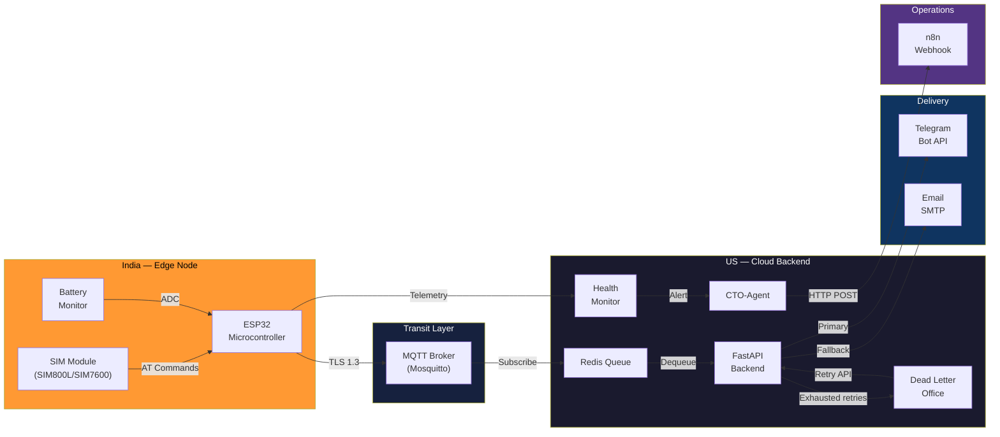

<div align="center">


# Indian SIM SMS Gateway

**High-Availability OTP Bridge — SMS to Telegram & Email**

[](https://python.org)
[](https://fastapi.tiangolo.com)
[](https://www.espressif.com/)
[](https://redis.io)
[](https://mosquitto.org)
[](LICENSE)

A resilient, self-healing SMS-to-Telegram/Email bridge designed for unattended operation across international infrastructure. Built to handle hardware instability, network latency, and Telegram API rate-limiting without message loss.

[Architecture](#system-architecture) · [Quick Start](#quick-start) · [Usage Examples](#usage-examples) · [Self-Healing](#self-healing-design) · [Security](#security-hardening) · [Benchmarks](#benchmarking)

</div>

---

## Overview

This project forwards Indian SIM card messages — OTPs, banking alerts, transaction notifications — to a US-based operator via Telegram Bot and Email. The SIM card stays in India; messages are forwarded over the internet using an ESP32 microcontroller as the edge node.

**Why this exists:** Indian bank OTPs and authentication codes are time-sensitive (typically 2–5 minutes). When operating from the US, you need sub-second forwarding through a pipeline that handles power outages, WiFi drops, and API rate limits autonomously.

### Design Principles

| Principle | Implementation |
|-----------|---------------|
| Zero message loss | Dead Letter Office captures every undeliverable message |
| Survive power cycles | ESP32 NVS flash stores last 5 SMS IDs for deduplication |
| Self-healing connectivity | Exponential backoff with jitter at every network layer |
| Autonomous operations | CTO-Agent triggers corrective actions via n8n webhooks |
| OTP security | Zero-log policy — message bodies never written to disk |

---

## System Architecture



**Pipeline:** `SIM Module → ESP32 → MQTT (TLS 1.3) → Redis Queue → FastAPI Workers → Telegram / Email`

Detailed diagrams (sequence, DLO flow, encryption layers, CTO-Agent cascade) are in [`docs/architecture.md`](docs/architecture.md).

---

## Quick Start

### Prerequisites

- Python 3.10+
- Docker & Docker Compose *(optional — for Redis and MQTT)*
- ESP32 DevKit + SIM800L/SIM7600 *(for hardware deployment)*

### Installation

```bash
# Clone the repository
git clone https://github.com/ambicuity/Indian-SIM-SMS-Gateway.git
cd Indian-SIM-SMS-Gateway

# Run the automated setup (creates venv, installs deps, generates Fernet key)
chmod +x scripts/setup.sh
bash scripts/setup.sh

# Configure your credentials
cp .env.example .env
# Edit .env — set TELEGRAM_BOT_TOKEN, TELEGRAM_CHAT_ID, and FERNET_ENCRYPTION_KEY
```

### Starting the Backend

```bash
# Option A: Docker Compose (starts Redis + MQTT + Backend)
docker-compose up -d

# Option B: Local development
cd backend
source .venv/bin/activate
uvicorn main:app --reload --port 8000
```

The API will be available at `http://localhost:8000`. Interactive docs at `http://localhost:8000/docs`.

### Flashing the ESP32

1. Open `firmware/esp32_sms_gateway/esp32_sms_gateway.ino` in Arduino IDE
2. Install the ESP32 board package via Board Manager
3. Edit `config.h` with your WiFi SSID/password and MQTT broker address
4. Select your ESP32 board and flash

---

## Usage Examples

### Submitting an SMS via API

This is the primary inbound endpoint. In production, the ESP32 publishes to MQTT, which bridges to this endpoint. For testing, you can call it directly:

```bash
curl -X POST http://localhost:8000/api/sms/inbound \
  -H "Content-Type: application/json" \
  -d '{
    "sender": "+919876543210",
    "body": "Your OTP is 482910. Valid for 5 minutes. -HDFC Bank",
    "sms_id": "sms-00001",
    "node_id": "esp32-node-01",
    "priority": "high"
  }'
```

**Response:**

```json
{
  "success": true,
  "message": "SMS sms-00001 enqueued for delivery",
  "data": {
    "sms_id": "sms-00001",
    "queue_depth": 1
  }
}
```

The message is now in the async queue. A worker will deliver it to Telegram (primary) or Email (fallback) within milliseconds.

### Checking System Health

```bash
curl http://localhost:8000/api/health
```

**Response (healthy system):**

```json
{
  "status": "healthy",
  "timestamp": 1739567310.42,
  "components": {
    "queue": { "running": true, "depth": 0, "consumers": 3 },
    "telegram": { "connected": true, "rate_limited": false },
    "nodes": {
      "esp32-node-01": {
        "last_seen": 1739567290.1,
        "battery_mv": 3850,
        "wifi_rssi": -65
      }
    }
  }
}
```

### Sending ESP32 Telemetry

The ESP32 firmware sends this automatically every 30 seconds. You can also simulate it:

```bash
curl -X POST http://localhost:8000/api/telemetry \
  -H "Content-Type: application/json" \
  -d '{
    "node_id": "esp32-node-01",
    "battery_mv": 3200,
    "wifi_rssi": -72,
    "wifi_state": 1,
    "reconnects": 3,
    "wdt_resets": 0,
    "uptime_sec": 86400,
    "heap_free": 180000
  }'
```

If `battery_mv` drops below the threshold (3300mV) or `wifi_rssi` is weaker than -100 dBm, the CTO-Agent will fire an alert to your n8n webhook.

### Viewing Dead-Lettered Messages

Messages that fail delivery after all retry attempts land in the Dead Letter Office:

```bash
# List all dead letters
curl http://localhost:8000/api/dlo
```

**Response:**

```json
{
  "success": true,
  "message": "2 dead-lettered messages",
  "data": {
    "count": 2,
    "dead_letters": [
      {
        "sms_id": "sms-00042",
        "sender": "+919876543210",
        "body": "[ENCRYPTED]",
        "retry_count": 5,
        "last_error": "Telegram API 429 Too Many Requests",
        "dead_lettered_at": 1739567100.5
      }
    ]
  }
}
```

```bash
# Retry a specific dead letter
curl -X POST http://localhost:8000/api/dlo/sms-00042/retry

# Purge all dead letters
curl -X DELETE http://localhost:8000/api/dlo
```

### Viewing System Metrics

```bash
curl http://localhost:8000/api/metrics
```

**Response:**

```json
{
  "timestamp": 1739567310.42,
  "queue": {
    "total_enqueued": 1247,
    "total_delivered": 1240,
    "total_failed": 7,
    "running": true
  },
  "telegram": {
    "total_sent": 1235,
    "total_rate_limited": 12,
    "total_errors": 5
  },
  "dlo": {
    "total_captured": 2,
    "current_count": 2
  },
  "cto_agent": {
    "total_alerts": 3,
    "total_suppressed": 1
  }
}
```

### Viewing CTO-Agent Incidents

```bash
curl http://localhost:8000/api/incidents?limit=5
```

**Response:**

```json
{
  "count": 1,
  "incidents": [
    {
      "id": "inc-20260214-001",
      "alert_type": "critical",
      "severity": "CRITICAL",
      "action": "RESTART_NETWORK_SWITCH",
      "issues": ["Node esp32-node-01: heartbeat timeout (185s ago)"],
      "webhook_status": "delivered",
      "timestamp": 1739567000.0
    }
  ]
}
```

### Running the Benchmark

```bash
# Simulation mode — no live server required
python scripts/benchmark.py --simulate --count 1000 --concurrency 50

# Against a running server
python scripts/benchmark.py --live --target http://localhost:8000 --count 1000

# Export results to JSON
python scripts/benchmark.py --simulate --count 1000 --output results.json
```

---

## API Reference

| Method | Endpoint | Description |
|--------|----------|-------------|
| `POST` | `/api/sms/inbound` | Receive and enqueue an inbound SMS |
| `POST` | `/api/telemetry` | Receive ESP32 node telemetry |
| `GET` | `/api/health` | System health with component status |
| `GET` | `/api/metrics` | Aggregated metrics from all subsystems |
| `GET` | `/api/dlo` | List dead-lettered messages |
| `POST` | `/api/dlo/{sms_id}/retry` | Re-enqueue a dead letter for retry |
| `DELETE` | `/api/dlo` | Purge all dead letters |
| `GET` | `/api/incidents` | CTO-Agent incident history |
| `GET` | `/docs` | Interactive Swagger UI |

---

## Self-Healing Design

### Exponential Backoff Strategy

Every network layer implements exponential backoff with jitter:

```
delay = min(base_delay × 2^attempt + random_jitter, max_delay)
```

| Layer | Base Delay | Max Delay | Jitter | Trigger |
|-------|:----------:|:---------:|:------:|---------|
| ESP32 WiFi | 1s | 60s | 0–500ms | Disconnection |
| MQTT Reconnect | 2s | 30s | 0–1s | Broker unreachable |
| Telegram API | 1s | 60s | — | HTTP 429 |
| Email SMTP | 1s | 8s | — | SMTP failure |
| Queue Retry | 2s | 60s | — | Consumer failure |

Jitter prevents the thundering herd problem — when a router reboots, all ESP32 nodes would otherwise reconnect simultaneously and overwhelm the network.

### Dead Letter Office

Messages that exhaust all retry attempts (default: 5) are moved to the Dead Letter Office — they are never silently dropped. Dead letters:

- Retain the original message metadata and error context
- Can be retried via `POST /api/dlo/{sms_id}/retry`
- Auto-purge after a configurable TTL (default: 72 hours)
- Trigger CTO-Agent alerts when the DLO count exceeds thresholds

### CTO-Agent Autonomous Response

The CTO-Agent evaluates system health and triggers corrective actions through n8n webhooks:

| Condition | Severity | Action |
|-----------|----------|--------|
| Heartbeat timeout > 120s | Critical | Restart network switch |
| Battery < 20% | Warning | Push notification to operator |
| Queue > 90% capacity | Emergency | Emergency queue drain |
| Signal < -100 dBm | Warning | Restart network switch |
| Watchdog resets > 5 | Warning | Restart gateway node |

Alerts include a 5-minute cooldown per alert type to prevent storm flooding. Webhook payloads are signed with HMAC-SHA256 for authenticity.

---

## Security Hardening

### Encryption in Transit

```
SIM Module → AES-256/Base64 → ESP32 → TLS 1.3 → MQTT Broker → Backend → Fernet Decrypt (in-memory only)
```

| Layer | Mechanism |
|-------|-----------|
| ESP32 → MQTT | TLS 1.3 transport encryption |
| SMS payload | AES-256 / Base64 encoding at the edge |
| Backend storage | Fernet symmetric encryption (at-rest) |
| Webhook auth | HMAC-SHA256 signed payloads |
| API | HTTPS + configurable rate limiting |

### Zero-Log Policy

OTP content is never written to disk at any point in the pipeline:

```python
# Only metadata reaches the logs
logger.info("Enqueued SMS %s from %s", sms_id, sender)

# Serialization redacts the body
msg.to_dict()  # → {"sms_id": "sms-001", "body": "[ENCRYPTED]", ...}
```

- No plaintext message bodies in logs or serialized data
- Console-only logging (no file handlers)
- Decryption occurs in-memory at the point of dispatch only

### ESP32 NVS Deduplication

A circular buffer of the last 5 SMS IDs is persisted to ESP32 flash (Non-Volatile Storage). This ensures no duplicate OTP forwarding after power cycles, watchdog resets, or brown-outs:

```cpp
// Survives: power cycles, watchdog resets, brown-outs
bool isDuplicate(const String& smsId) {
    String hash = sha256(smsId);  // Deterministic ID
    for (int i = 0; i < MAX_STORED_SMS_IDS; i++) {
        if (_smsIds[i] == hash) return true;
    }
    return false;
}
```

---

## Cost-Efficiency Analysis

### VoWiFi — Eliminating International Roaming

The SIM card physically stays in India. SMS is received locally and forwarded over the internet via encrypted MQTT. No roaming required.

```
Traditional:  SIM in US → Indian carrier roaming → $0.50–$1.00/SMS
This project:  SIM in India → WiFi → MQTT → US backend → $0.00/SMS
```

| Component | Cost | Notes |
|-----------|-----:|-------|
| Indian SIM (Jio) | $2.40/mo | ₹199 plan, unlimited local SMS |
| ESP32 DevKit | $4.50 | One-time |
| SIM800L module | $3.00 | One-time, GSM modem |
| Redis Cloud | $0.00 | Free tier, 30MB |
| MQTT (HiveMQ) | $0.00 | Free tier |
| Telegram Bot | $0.00 | 30 msg/sec limit |
| **Monthly total** | **$2.40** | vs. $30–$50 roaming |

**Annual savings: $330–$570** compared to international roaming plans.

---

## Benchmarking

### Results — 1,000 Concurrent SMS

Tested using the included benchmark script in simulation mode (in-memory queue, no network I/O):

| Metric | Value |
|--------|------:|
| Throughput | 495.8 msg/sec |
| P50 latency | < 0.01ms |
| P99 latency | 0.01ms |
| Error rate | 0% |
| Simulated failures auto-retried | ~22 |
| Queue capacity | 10,000 messages |

> Actual end-to-end throughput is bounded by Telegram API rate limits (30 msg/sec per chat). The benchmark measures internal queue processing capacity independent of downstream constraints.

---

## Testing

```bash
# All tests
python -m pytest tests/ -v

# Individual suites
python -m pytest tests/test_message_queue.py -v
python -m pytest tests/test_dead_letter_office.py -v
python -m pytest tests/test_cto_agent.py -v

# With coverage report
python -m pytest tests/ --cov=backend --cov-report=term-missing
```

| Suite | Tests | Scope |
|-------|:-----:|-------|
| `test_message_queue.py` | 10 | Enqueue/dequeue, concurrency, backpressure, retry, fallback, DLO routing, encryption |
| `test_dead_letter_office.py` | 11 | Capture, retrieval, retry, purge, TTL expiry, serialization, zero-log |
| `test_cto_agent.py` | 13 | Alert triggering, cooldown, webhook payloads, HMAC signing, incident history, severity routing |

---

## Project Structure

```
Indian-SIM-SMS-Gateway/
├── firmware/esp32_sms_gateway/     # C++ — ESP32 edge node firmware
│   ├── esp32_sms_gateway.ino       #   Main loop: read SMS → dedup → encrypt → publish
│   ├── config.h                    #   Compile-time configuration
│   ├── sms_handler.h/.cpp          #   NVS-backed circular buffer deduplication
│   ├── watchdog_manager.h/.cpp     #   Task Watchdog Timer (TWDT) management
│   └── wifi_manager.h/.cpp         #   Exponential backoff WiFi reconnection
│
├── backend/                        # Python — FastAPI async backend
│   ├── main.py                     #   Application entry point, API routes, lifecycle
│   ├── config.py                   #   Pydantic Settings from .env
│   ├── message_queue.py            #   Async producer-consumer with bounded queue
│   ├── telegram_dispatcher.py      #   Telegram Bot API with rate-limit handling
│   ├── email_dispatcher.py         #   SMTP fallback dispatcher
│   ├── dead_letter_office.py       #   Failed message retention and retry
│   ├── health_monitor.py           #   Node telemetry aggregation and alerting
│   ├── cto_agent.py                #   n8n webhook integration, HMAC signing
│   └── requirements.txt            #   Python dependencies
│
├── scripts/
│   ├── benchmark.py                #   Load test: 1K concurrent SMS simulation
│   └── setup.sh                    #   Automated environment setup
│
├── tests/                          #   pytest async test suites (34 tests)
├── docs/architecture.md            #   Mermaid.js architecture diagrams
├── docker-compose.yml              #   Redis + Mosquitto + Backend
├── .env.example                    #   Environment variable template
├── LICENSE                         #   MIT
└── README.md
```

---

## Contributing

1. Fork the repository
2. Create a feature branch: `git checkout -b feature/your-feature`
3. Commit your changes: `git commit -m 'Add feature'`
4. Push to branch: `git push origin feature/your-feature`
5. Open a Pull Request

---

## License

MIT — see [LICENSE](LICENSE) for details.
