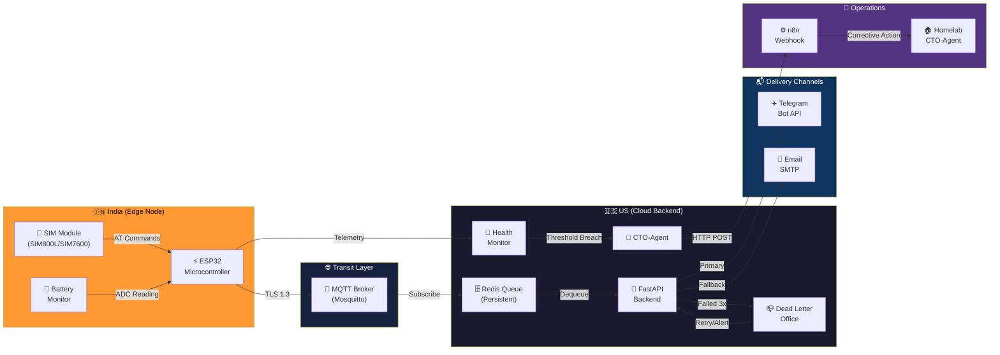
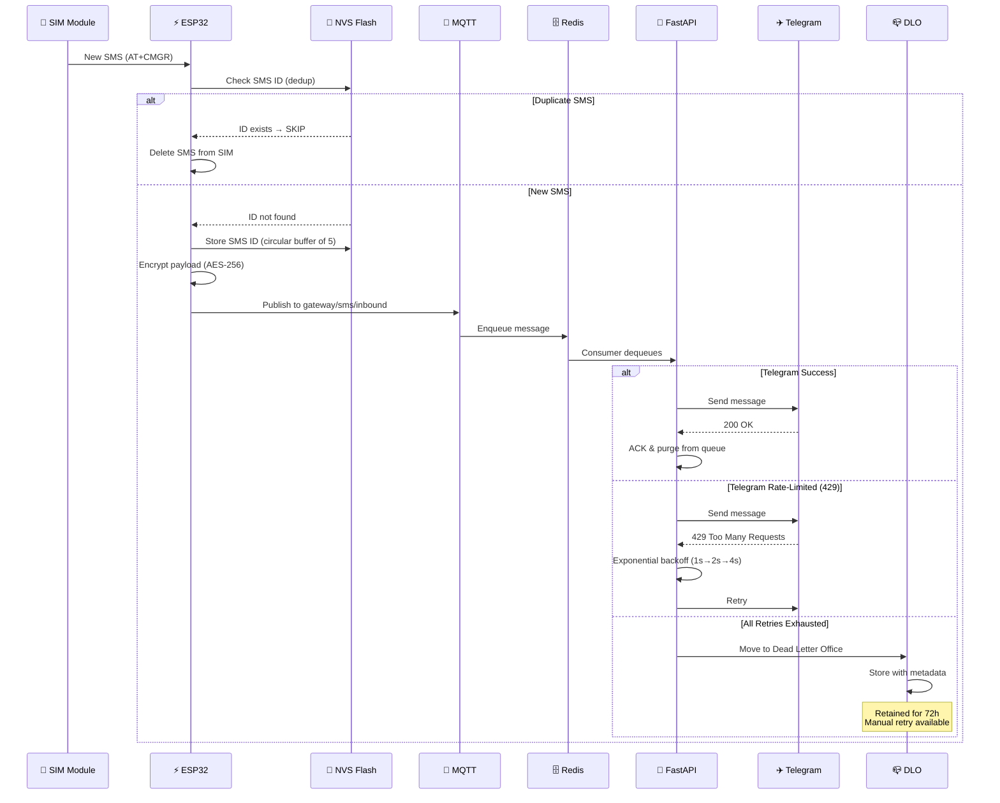
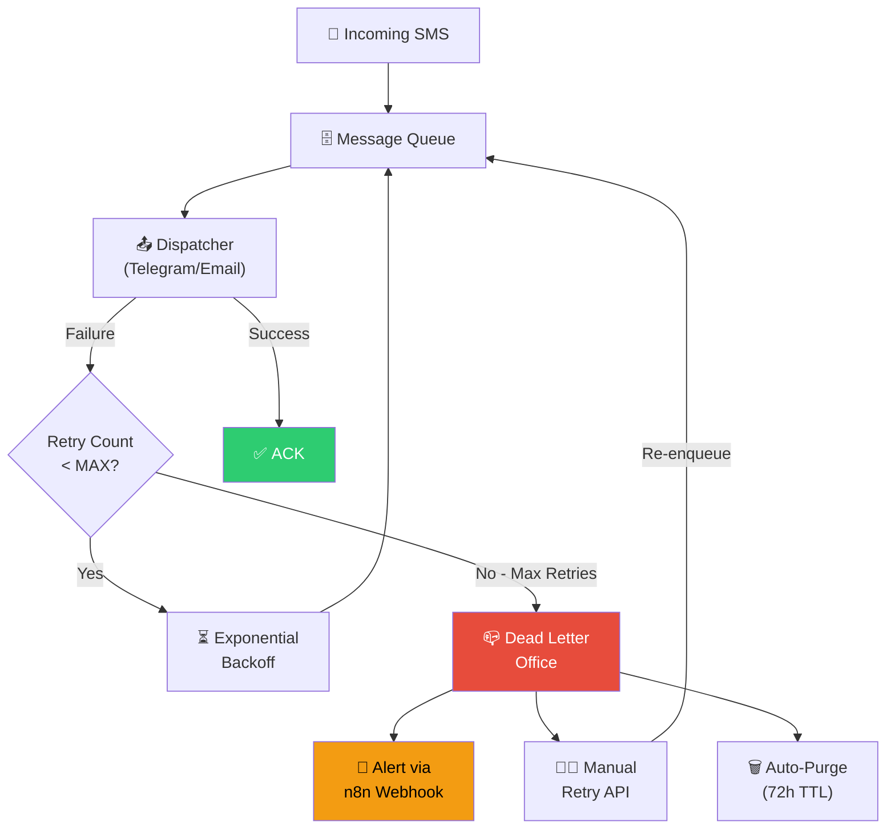
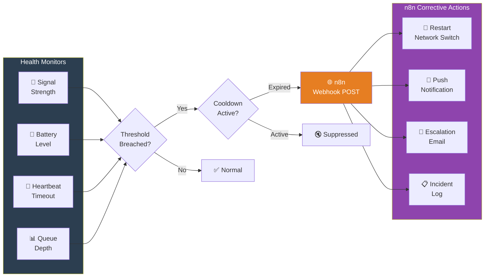
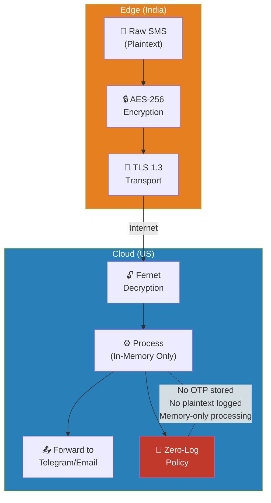

# System Architecture — Indian SIM SMS Gateway

## High-Level Pipeline

---

## SMS Lifecycle — Sequence Diagram

---

## Dead Letter Office (DLO) Flow

---

## CTO-Agent Alert Flow

---

## Data Flow & Encryption

