# System Architecture — Indian SIM SMS Gateway

## High-Level Pipeline

```mermaid
flowchart LR
    subgraph India["🇮🇳 India (Edge Node)"]
        SIM["📱 SIM Module\n(SIM800L/SIM7600)"]
        ESP["⚡ ESP32\nMicrocontroller"]
        BAT["🔋 Battery\nMonitor"]
    end

    subgraph Transit["🌐 Transit Layer"]
        MQTT["📡 MQTT Broker\n(Mosquitto)"]
    end

    subgraph US["🇺🇸 US (Cloud Backend)"]
        REDIS["🗄️ Redis Queue\n(Persistent)"]
        API["🐍 FastAPI\nBackend"]
        DLO["📪 Dead Letter\nOffice"]
        HEALTH["💓 Health\nMonitor"]
        CTO["🤖 CTO-Agent"]
    end

    subgraph Delivery["📬 Delivery Channels"]
        TG["✈️ Telegram\nBot API"]
        EMAIL["📧 Email\nSMTP"]
    end

    subgraph Ops["🔧 Operations"]
        N8N["⚙️ n8n\nWebhook"]
        HOMELAB["🏠 Homelab\nCTO-Agent"]
    end

    SIM -->|AT Commands| ESP
    BAT -->|ADC Reading| ESP
    ESP -->|TLS 1.3| MQTT
    MQTT -->|Subscribe| REDIS
    REDIS -->|Dequeue| API
    API -->|Primary| TG
    API -->|Fallback| EMAIL
    API -->|Failed 3x| DLO
    DLO -->|Retry/Alert| API
    ESP -->|Telemetry| HEALTH
    HEALTH -->|Threshold Breach| CTO
    CTO -->|HTTP POST| N8N
    N8N -->|Corrective Action| HOMELAB

    style India fill:#ff9933,color:#000
    style US fill:#1a1a2e,color:#fff
    style Transit fill:#16213e,color:#fff
    style Delivery fill:#0f3460,color:#fff
    style Ops fill:#533483,color:#fff
```

---

## SMS Lifecycle — Sequence Diagram

```mermaid
sequenceDiagram
    participant SIM as 📱 SIM Module
    participant ESP as ⚡ ESP32
    participant NVS as 💾 NVS Flash
    participant MQTT as 📡 MQTT
    participant Redis as 🗄️ Redis
    participant API as 🐍 FastAPI
    participant TG as ✈️ Telegram
    participant DLO as 📪 DLO

    SIM->>ESP: New SMS (AT+CMGR)
    ESP->>NVS: Check SMS ID (dedup)
    
    alt Duplicate SMS
        NVS-->>ESP: ID exists → SKIP
        ESP->>ESP: Delete SMS from SIM
    else New SMS
        NVS-->>ESP: ID not found
        ESP->>NVS: Store SMS ID (circular buffer of 5)
        ESP->>ESP: Encrypt payload (AES-256)
        ESP->>MQTT: Publish to gateway/sms/inbound
        MQTT->>Redis: Enqueue message
        Redis->>API: Consumer dequeues
        
        alt Telegram Success
            API->>TG: Send message
            TG-->>API: 200 OK
            API->>API: ACK & purge from queue
        else Telegram Rate-Limited (429)
            API->>TG: Send message
            TG-->>API: 429 Too Many Requests
            API->>API: Exponential backoff (1s→2s→4s)
            API->>TG: Retry
        else All Retries Exhausted
            API->>DLO: Move to Dead Letter Office
            DLO->>DLO: Store with metadata
            Note over DLO: Retained for 72h<br/>Manual retry available
        end
    end
```

---

## Dead Letter Office (DLO) Flow

```mermaid
flowchart TD
    MSG["📨 Incoming SMS"]
    Q["🗄️ Message Queue"]
    DISPATCH["📤 Dispatcher\n(Telegram/Email)"]
    RETRY{"Retry Count\n< MAX?"}
    BACKOFF["⏳ Exponential\nBackoff"]
    DLO["📪 Dead Letter\nOffice"]
    ALERT["🚨 Alert via\nn8n Webhook"]
    MANUAL["👨‍💻 Manual\nRetry API"]
    PURGE["🗑️ Auto-Purge\n(72h TTL)"]

    MSG --> Q
    Q --> DISPATCH
    DISPATCH -->|Success| ACK["✅ ACK"]
    DISPATCH -->|Failure| RETRY
    RETRY -->|Yes| BACKOFF
    BACKOFF --> Q
    RETRY -->|No - Max Retries| DLO
    DLO --> ALERT
    DLO --> MANUAL
    DLO --> PURGE
    MANUAL -->|Re-enqueue| Q

    style DLO fill:#e74c3c,color:#fff
    style ACK fill:#2ecc71,color:#fff
    style ALERT fill:#f39c12,color:#000
```

---

## CTO-Agent Alert Flow

```mermaid
flowchart LR
    subgraph Monitors["Health Monitors"]
        SIG["📶 Signal\nStrength"]
        BAT["🔋 Battery\nLevel"]
        HB["💓 Heartbeat\nTimeout"]
        QD["📊 Queue\nDepth"]
    end

    EVAL{"Threshold\nBreached?"}
    COOL{"Cooldown\nActive?"}
    WEBHOOK["🌐 n8n\nWebhook POST"]

    subgraph Actions["n8n Corrective Actions"]
        RESTART["🔄 Restart\nNetwork Switch"]
        NOTIFY["📱 Push\nNotification"]
        ESCAL["🚨 Escalation\nEmail"]
        LOG["📋 Incident\nLog"]
    end

    SIG --> EVAL
    BAT --> EVAL
    HB --> EVAL
    QD --> EVAL

    EVAL -->|No| SKIP["✅ Normal"]
    EVAL -->|Yes| COOL
    COOL -->|Active| SUPPRESS["🔇 Suppressed"]
    COOL -->|Expired| WEBHOOK
    WEBHOOK --> RESTART
    WEBHOOK --> NOTIFY
    WEBHOOK --> ESCAL
    WEBHOOK --> LOG

    style Monitors fill:#2c3e50,color:#fff
    style Actions fill:#8e44ad,color:#fff
    style WEBHOOK fill:#e67e22,color:#fff
```

---

## Data Flow & Encryption

```mermaid
flowchart TD
    subgraph Edge["Edge (India)"]
        RAW["📝 Raw SMS\n(Plaintext)"]
        ENC["🔒 AES-256\nEncryption"]
        TLS["🔐 TLS 1.3\nTransport"]
    end

    subgraph Cloud["Cloud (US)"]
        DEC["🔓 Fernet\nDecryption"]
        PROC["⚙️ Process\n(In-Memory Only)"]
        FWD["📤 Forward to\nTelegram/Email"]
        ZERO["🚫 Zero-Log\nPolicy"]
    end

    RAW --> ENC
    ENC --> TLS
    TLS -->|Internet| DEC
    DEC --> PROC
    PROC --> FWD
    PROC --> ZERO

    ZERO -.-|"No OTP stored\nNo plaintext logged\nMemory-only processing"| PROC

    style Edge fill:#e67e22,color:#fff
    style Cloud fill:#2980b9,color:#fff
    style ZERO fill:#c0392b,color:#fff
```

